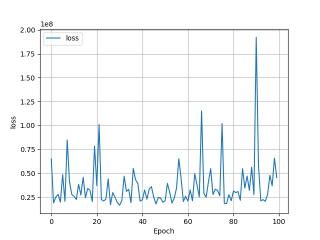
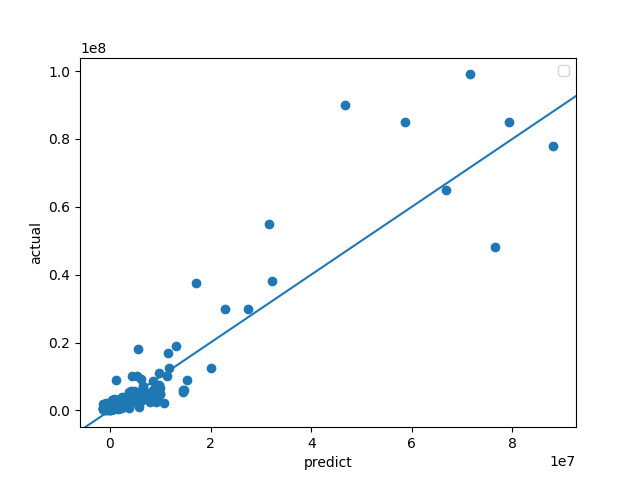
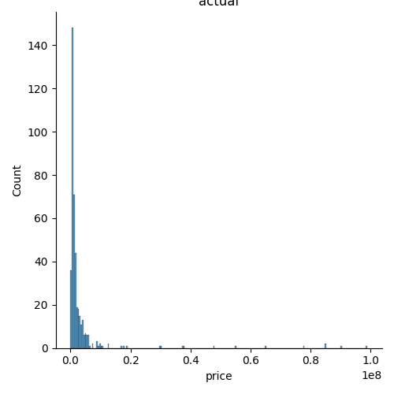
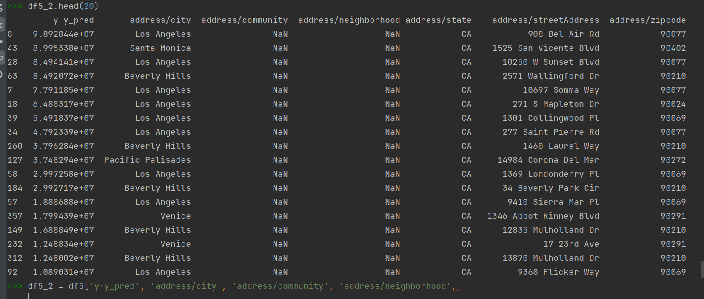
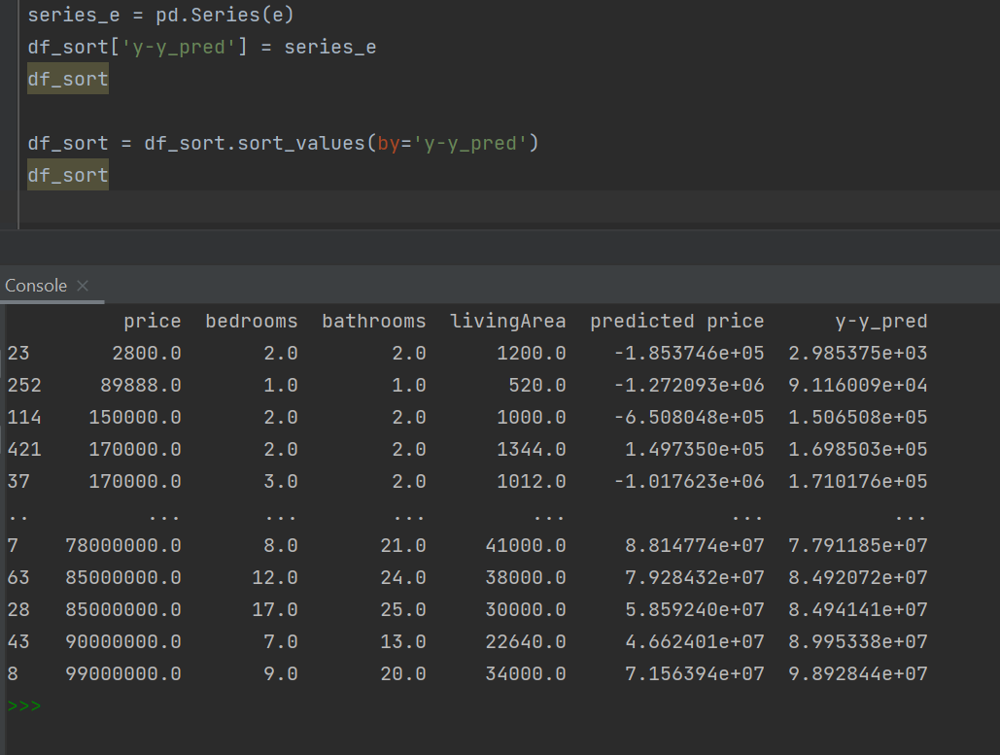
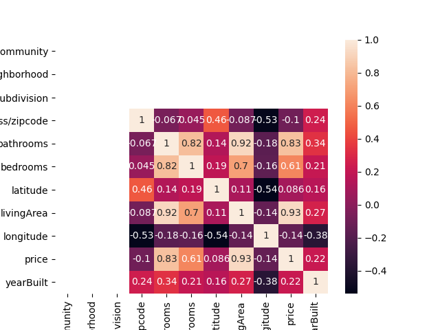

Graphs with inverse transformed/unscaled data

loss plot

actual vs. predicted price

number 2
histogram of actual house prices

spatial variable

number 3
sorted ascending y-y_pred

number 4
heatmap/correlation coefficients

