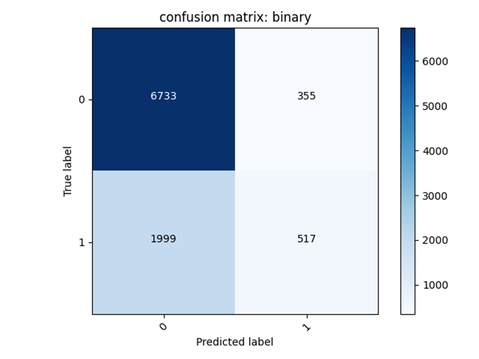
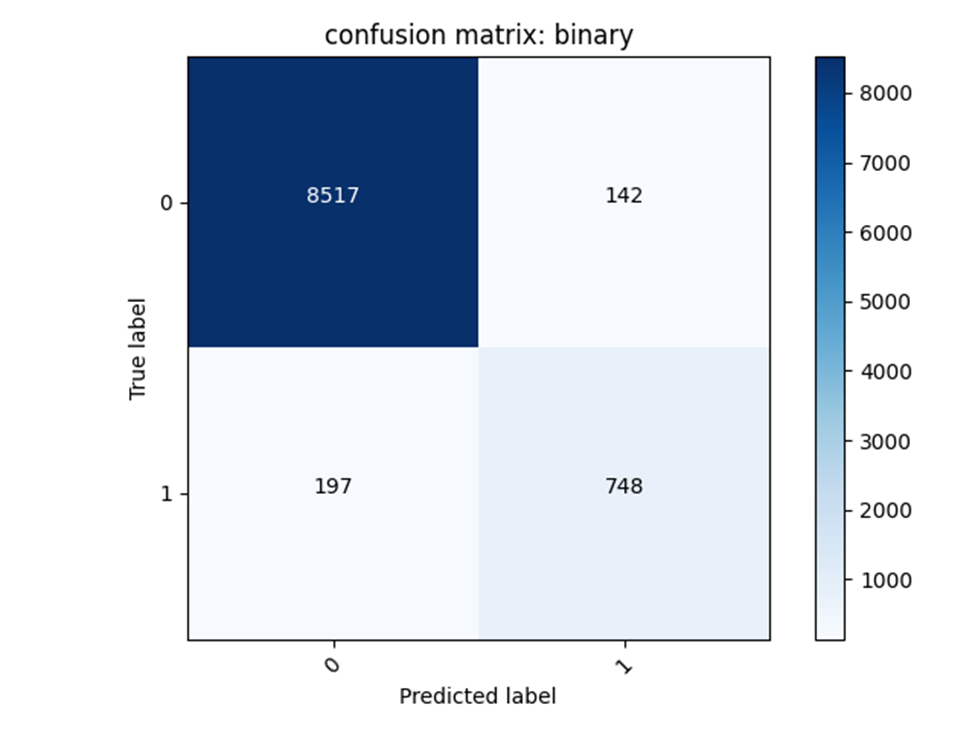
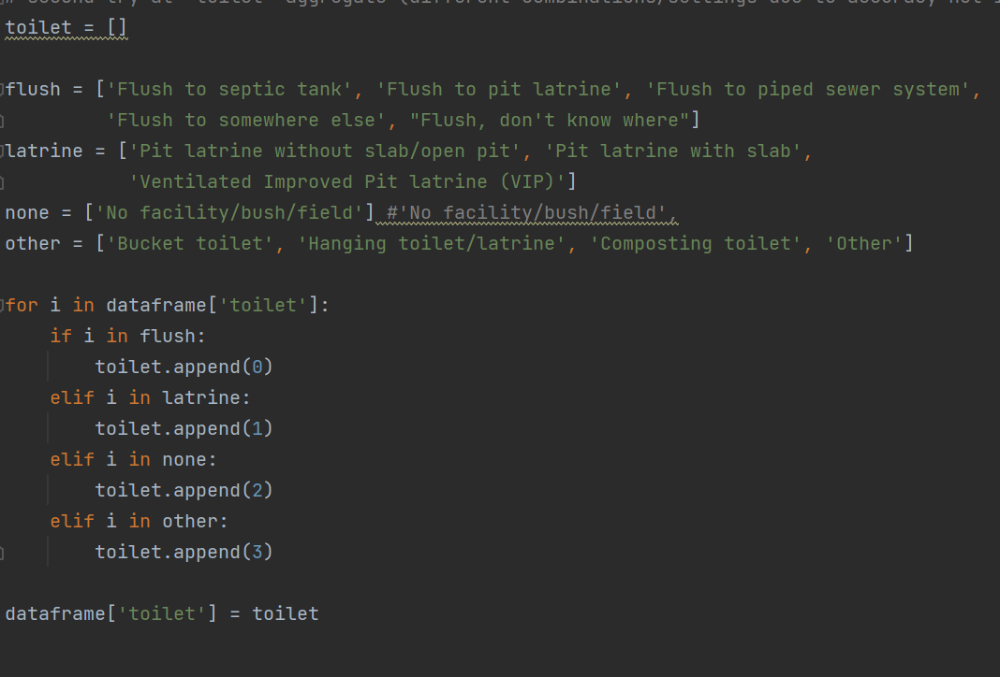
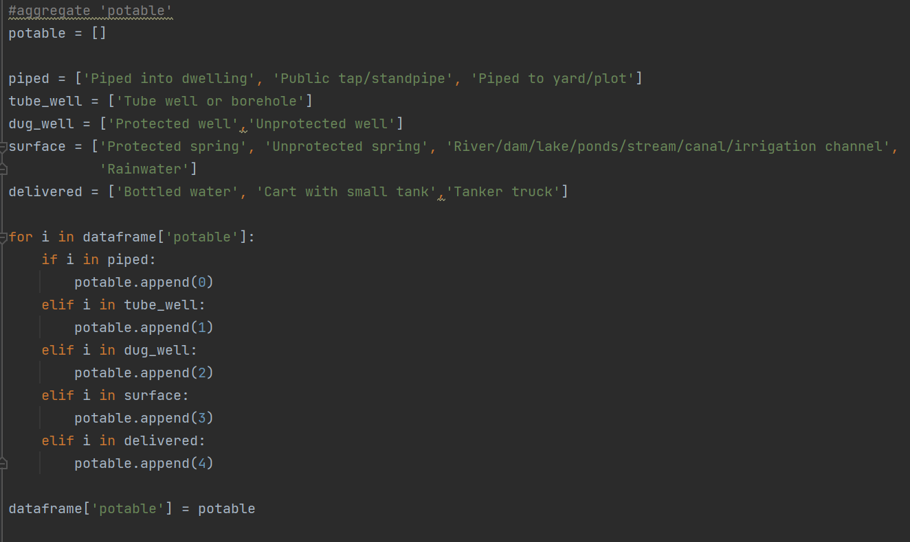
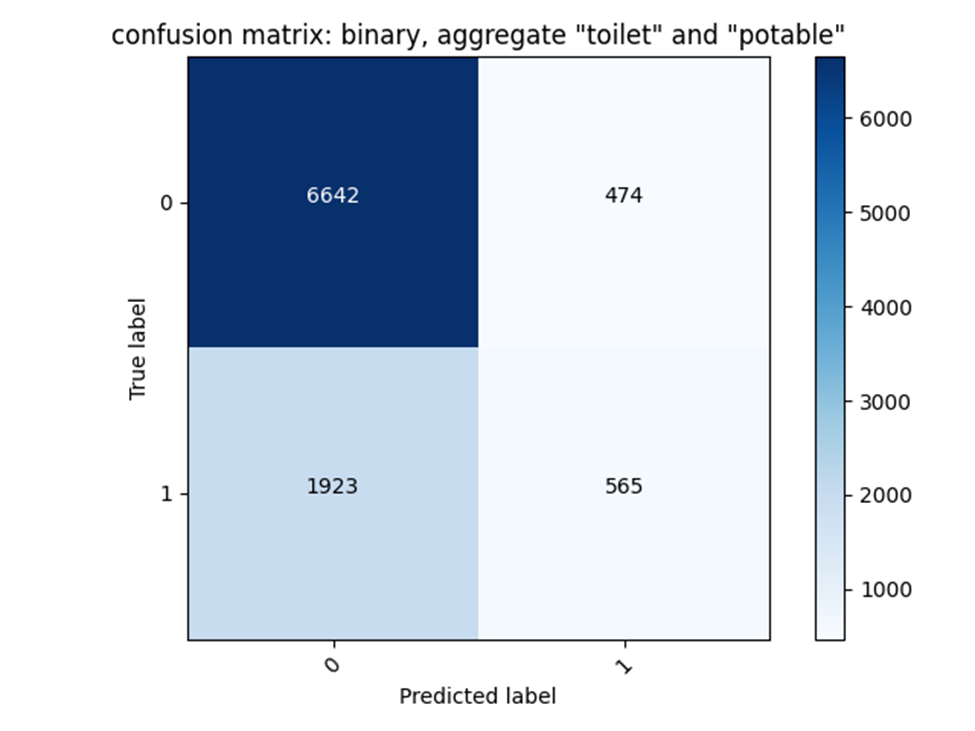
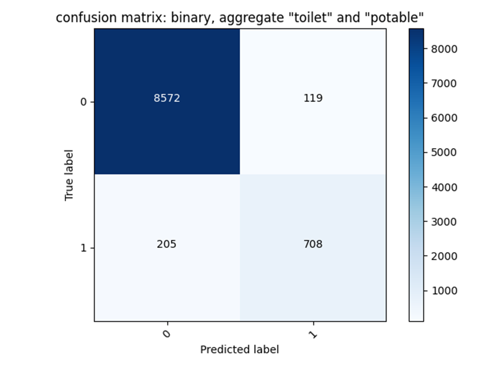
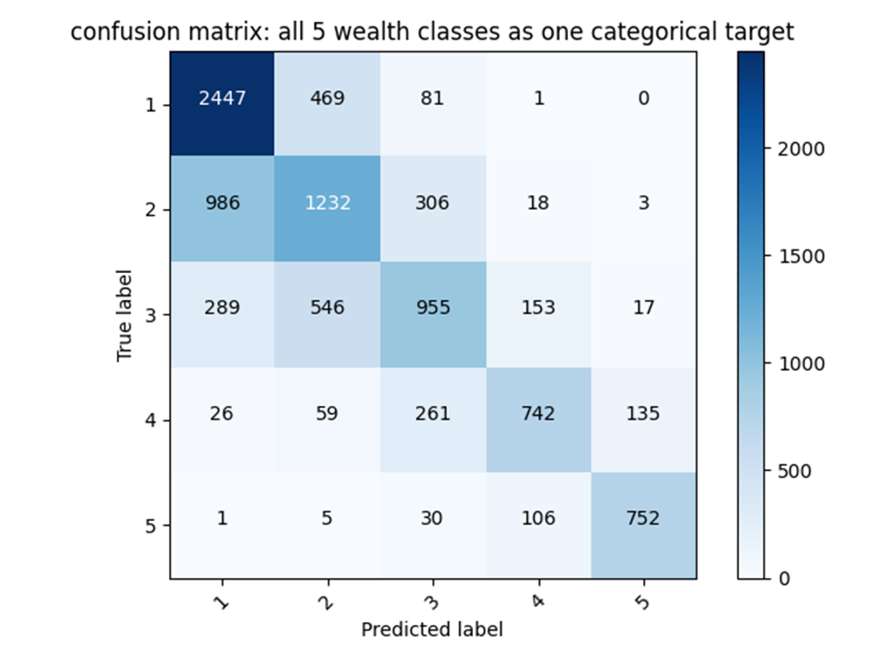
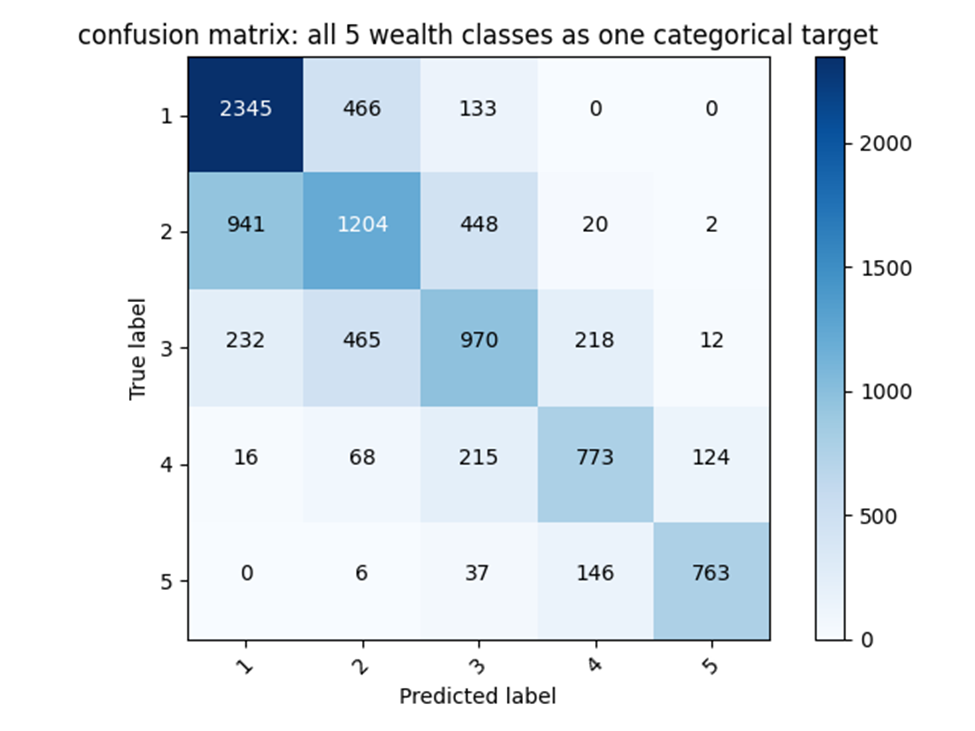
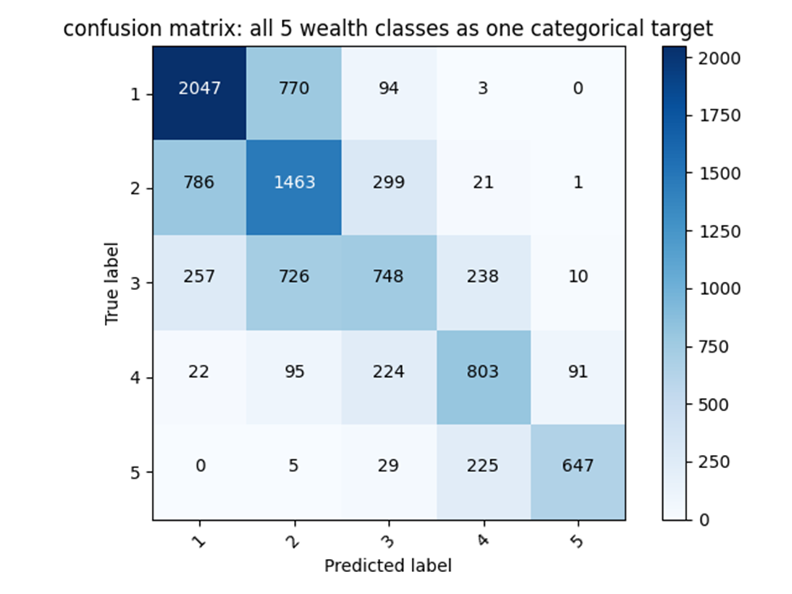
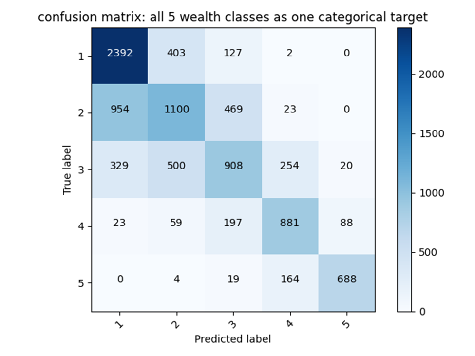

### Project 3 Images

#### binary models confusion matrices after removing "education" and "age" missing values + change feature columsn to numeric, bucketized, and indicators only (no embedding)

- wealth 2

  
- wealth 5

  
#### aggregate "toilet" and "potable"
- toilet aggregate

  
- potable aggregate

  

#### binary models aggregate confusion matrices
- wealth 2

  
- wealth 5

  

---------------------------------------------------------
#### categorical target
- first model

  
- second model

  
- third model

  
- fourth model

