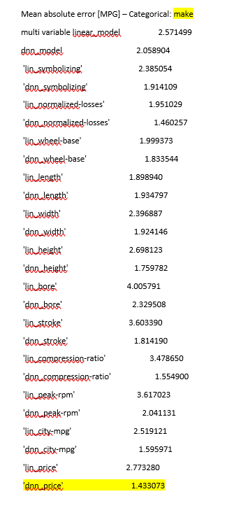

Dataframes showing Mean Average Error for the continuous/numeric features, 
with each dataframe ran with a different categorical variable.

####categorical variable = num-of-cylinders

####categorical variable = make

####categorical variable = fuel-type

####categorical variable = aspiration

####categorical variable = num-of-doors

####categorical variable = body-style

####categorical variable = drive-wheels

####categorical variable = engine

####categorical variable = engine-location

####categorical variable = engine-type

####categorical variable = fuel-system
