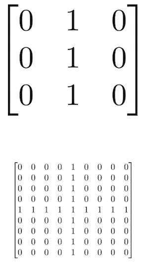
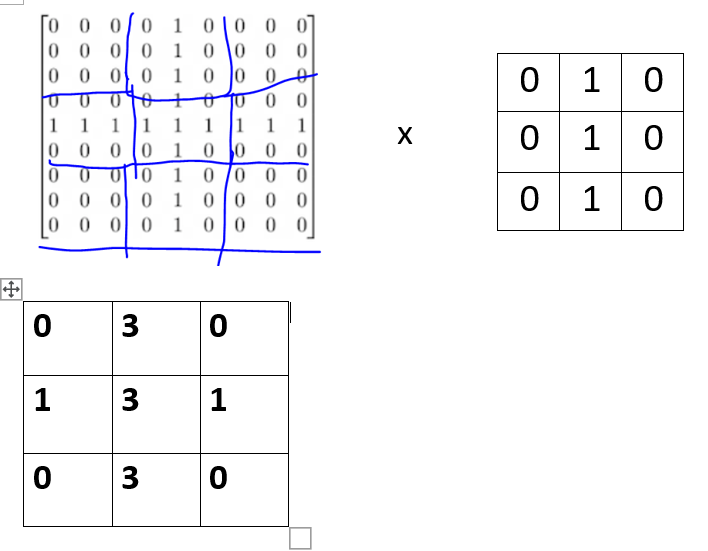

### Convolution

filter = [ [-1, -2, -1], [0, 0, 0], [1, 2, 1]]

filter=  [ [0, 1, 0], [1, -4, 1], [0, 1, 0]]

filter = [ [-1, 0, 1], [-2, 0, 2], [-1, 0, 1]]

### Pooling

 - pooling of the first convoluted filtered image

answer: 
