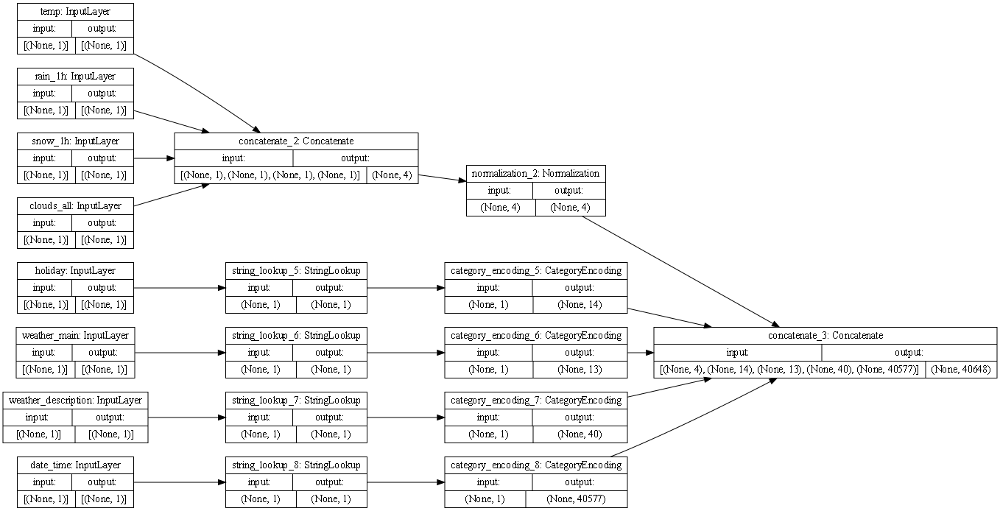
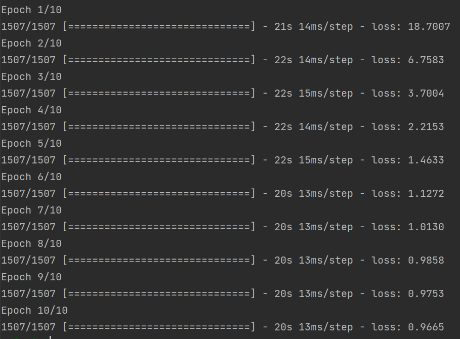
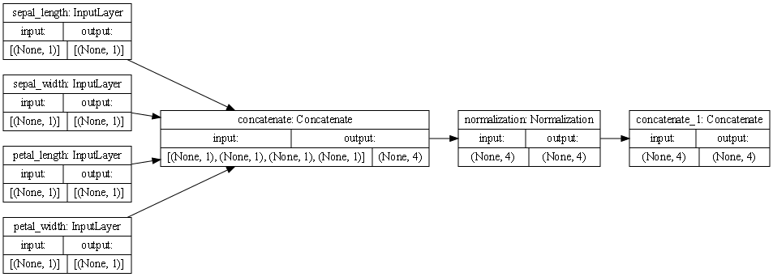
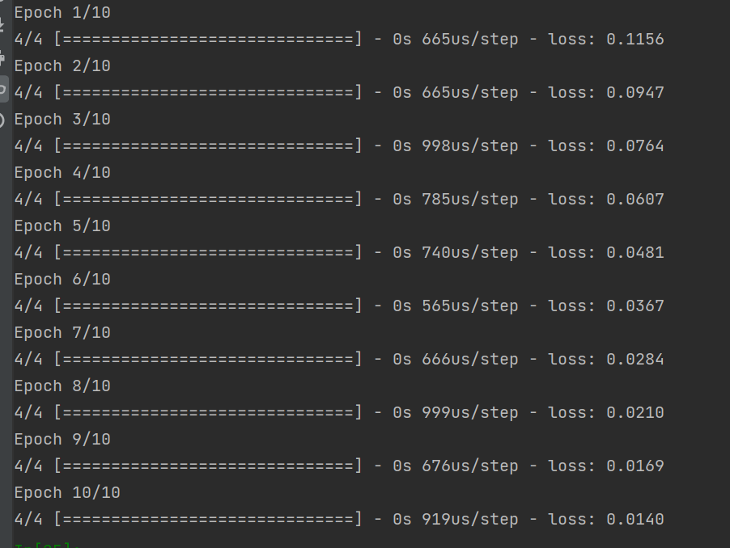
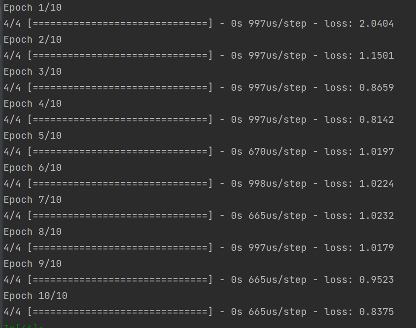
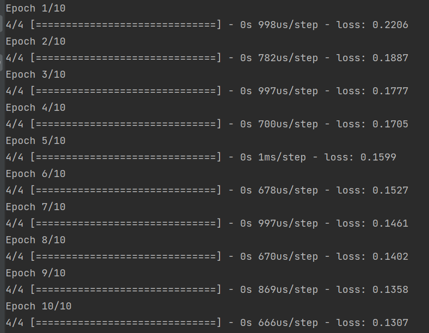

## Plots

#### metro plot

#### metro model output

#### iris plot

#### iris model output
- iris['species'] = np.where(iris['species'] == 0,1,0)
  

- iris['species'] = np.where(iris['species'] == 1,1,0)
  

- iris['species'] = np.where(iris['species'] == 2,1,0)
  